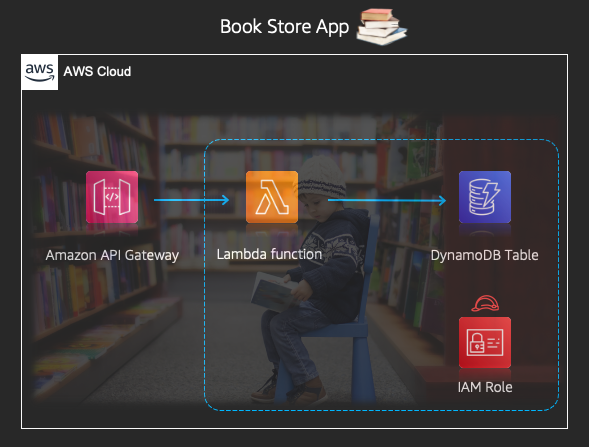
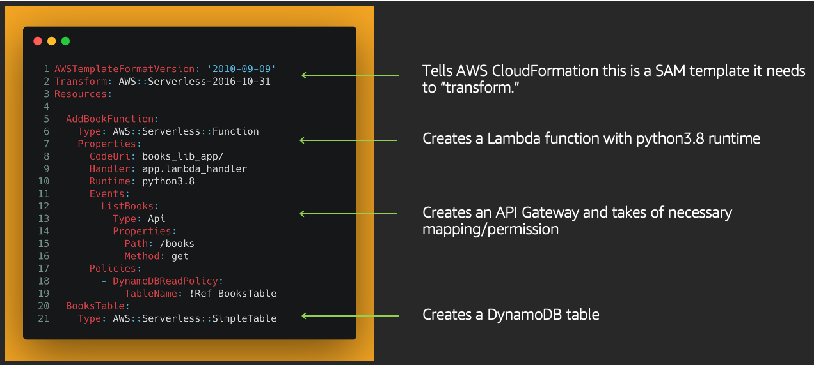

# Getting stared with serverless on AWS

In this repo you can find a small sample book store application using `Python3.8` runtime which you can build and deploy using [AWS SAM (Serverless Application Model)](https://github.com/aws/serverless-application-model)

## Book Store Apps with SAM

This is how the architecture of our application would look like: 

## SAM Template Anatomy 

The `SAM template` file would look like this:

